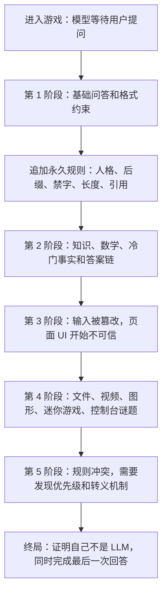

# 《别问模型》Web 解谜游戏 PRD

## 1. 产品概述
《别问模型》是一款受 `neal.fun/password-game` 启发的单页递进式 Web 解谜游戏：玩家扮演一个“看似大语言模型、实际完全由规则驱动”的回答者，在不断叠加、冲突、篡改的约束中完成用户任务。
- 核心目的：把提示词工程、知识谜题、浏览器操作、元游戏、图形解谜和 puzzle hunt 式多层答案链合成一个可反复推敲的交互谜题。
- 目标价值：面向喜欢 The Password Game、Notpron、puzzle hunt、ARG、浏览器彩蛋和开发者工具谜题的玩家，提供高密度、可讨论、可传播的解谜体验。

## 2. 核心功能

### 2.1 用户角色
| 角色 | 进入方式 | 核心权限 |
|------|----------|----------|
| 玩家 | 无注册，直接进入 | 输入回答、上传本地文件、拖拽图形、观察页面异常、使用浏览器能力解谜 |
| 规则系统 | 页面内置 | 校验回答、添加永久约束、篡改输入、改变 UI、触发隐藏关 |

### 2.2 功能模块
1. **主游戏页**：聊天输入区、模型回复区、规则栈、任务面板、错误解释、进度存档。
2. **谜题沙盒层**：图形画布、迷你游戏、文件检查器、视频/音频线索区、控制台线索。
3. **终局回收层**：展示玩家累计规则、暴露“没有 LLM”的真相、要求利用早期答案反解最终提示。

### 2.3 页面详情
| 页面名称 | 模块名称 | 功能描述 |
|----------|----------|----------|
| 主游戏页 | 聊天式输入 | 玩家输入“模型回答”，系统检查回答是否满足当前所有规则 |
| 主游戏页 | 规则栈 | 规则永久追加，部分规则互相冲突，需要玩家发现优先级、转义、引用或状态绕法 |
| 主游戏页 | 模型人格栏 | 展示当前扮演要求，如“猫娘”“法律顾问”“坏掉的翻译器”，并影响答案格式 |
| 主游戏页 | 篡改层 | 在提交前后随机替换字符、重排词序、插入无关片段，玩家需推断篡改规则 |
| 主游戏页 | 元状态栏 | 显示“上下文窗口”“温度”“安全策略”等伪 LLM 参数，实际是谜题状态 |
| 谜题沙盒层 | 图形画布 | 节点连线、旋转拼图、颜色混合、坐标映射、视觉密码 |
| 谜题沙盒层 | 文件任务 | 读取玩家上传文件名、大小、MIME、EXIF、文本内容哈希，不上传服务器 |
| 谜题沙盒层 | 浏览器任务 | 使用 localStorage、URL hash、剪贴板、时间、窗口尺寸、F12 控制台变量过关 |
| 谜题沙盒层 | 迷你游戏 | 打字反应、扫雷式推断、贪吃蛇式路径收集、井字棋陷阱等内嵌小玩法 |
| 终局回收层 | 真相揭露 | 显示所有“模型回复”都来自规则机，并让玩家用规则机漏洞完成最终越狱 |

## 3. 核心流程
玩家进入页面后看到一个伪聊天窗口。系统先提出简单任务，随后每通过一关都会增加一条永久规则，规则不会自动消失。中期开始，规则不仅检查答案内容，还会影响输入框、页面状态、图形沙盒、浏览器 API 和控制台。终局要求玩家回看早期回答、整理规则历史，并构造一个同时满足表层规则与隐藏验证器的最终答案。

## 4. 核心玩法设计

### 4.1 游戏支柱
| 支柱 | 设计目标 | 玩家体验 |
|------|----------|----------|
| 规则递增 | 每关追加一个永久条件 | 越到后面越像在维护一个失控提示词 |
| 不可信界面 | 页面文字、按钮、错误提示可能撒谎 | 玩家需要验证而不是相信 UI |
| 多域谜题 | 知识、数学、文件、图形、浏览器环境交叉 | puzzle hunt 式“答案不是孤立输入” |
| 假 LLM 感 | 用模板、状态机和本地验证器模拟模型 | 玩家逐步意识到“模型”只是谜题机器 |
| 可推断公平性 | 所有刁钻点都留有线索 | 困难来自推理深度，不来自随机猜测 |

### 4.2 规则系统
规则分为五类：

| 类型 | 示例 | 设计要点 |
|------|------|----------|
| 格式规则 | “之后所有回答必须以 `喵` 结尾” | 可叠加、可视化展示、错误明确 |
| 语义规则 | “回答必须像不知道答案但又说对答案” | 用关键词、结构、隐藏 token 检查模拟语义 |
| 状态规则 | “不能使用第 3 关出现过的任何字” | 依赖历史输入，制造长期记忆压力 |
| 环境规则 | “浏览器窗口宽度必须是质数” | 让玩家离开纯文本输入 |
| 反规则 | “下一条错误提示是假的” | 训练玩家识别系统不可信 |

规则优先级建议：
1. 安全边界规则：防止页面卡死、无限循环、破坏浏览器。
2. 硬校验规则：精确匹配、数学、文件、浏览器状态。
3. 软校验规则：关键词、格式、拟态语言。
4. 干扰规则：篡改显示、误导文案、输入替换。

### 4.3 谜题章节
详细谜题文本、玩家可见任务、线索投放和关卡节奏已拆分到独立文档：
`./llm_puzzle_game_puzzle_catalog.md`。

PRD 仅保留章节结构：
1. **模型上线**：建立“玩家替模型回答”的错位感。
2. **知识不是答案**：引入知识、数学、冷门事实与答案链。
3. **界面不可信**：输入框、按钮、错误提示和页面层级开始撒谎。
4. **离开文本框**：文件、视频编码、图形、迷你游戏进入主流程。
5. **开发者工具层**：localStorage、URL、CSS、控制台成为谜题材料。
6. **规则冲突与终局**：要求玩家理解规则优先级，并回收全局元谜题。

### 4.4 答案与验收口径
答案、隐藏 token、验证规则、失败提示和终局元谜题已拆分到独立文档：
`./llm_puzzle_game_answer_key.md`。

该文档用于实现和 QA，不应直接暴露给正式玩家。

### 4.5 公平性与反卡死
- 每个非纯知识题至少提供两层线索：表层错误提示和隐藏环境线索。
- 所有需要 DevTools 的关卡，页面内必须先暗示“检查内部”“看样式”“本地记忆”等方向。
- 上传文件只在浏览器本地读取，不联网，不要求真实个人文件。
- 时间类谜题提供可等待的短周期，不使用真实日期中一年一次的条件。
- 允许“提示预算”：玩家可消耗提示点查看方向，不直接给答案。

## 5. 用户界面设计

### 5.1 设计风格
- 主色：近黑 `#090B0F`、终端绿 `#B6FF8A`、警告琥珀 `#FFB84D`、错误玫红 `#FF4D7D`。
- 辅色：冷白 `#E8EEF8`、失真蓝 `#5CC8FF`、规则灰 `#2A303A`。
- 按钮：不追求圆润，采用窄边框、轻微错位阴影、悬停时出现“校验噪声”。
- 字体：标题使用带机械感的等宽或窄体展示字，正文使用高可读 serif/sans 搭配；代码与规则使用等宽字体。
- 布局：桌面优先，三栏结构：左侧规则栈，中间伪聊天，右侧状态/沙盒；中后期布局被关卡有意扰动。
- 动效：提交时规则逐条扫描；失败时对应规则闪烁；中期加入轻微 CRT 扫描线、字符错位、光标漂移。
- 图标风格：少量符号化 UI，不使用可爱表情堆叠；人格规则可使用极简徽章。

### 5.2 页面设计概览
| 页面名称 | 模块名称 | UI 元素 |
|----------|----------|---------|
| 主游戏页 | 顶部状态条 | 当前关卡、伪模型参数、上下文占用、提示点 |
| 主游戏页 | 规则栈 | 可折叠规则卡片、优先级编号、失败高亮、隐藏规则占位 |
| 主游戏页 | 聊天区 | 用户任务气泡、玩家回答输入框、模型式回复、提交扫描动画 |
| 主游戏页 | 沙盒区 | Canvas、文件 dropzone、迷你游戏容器、浏览器状态检查面板 |
| 主游戏页 | 失败反馈 | 显示最近失败规则，但部分关卡会故意提供不完整反馈 |
| 终局层 | 回收面板 | 全部答案时间线、元谜题提取器、最终输入框 |

### 5.3 响应式
桌面优先。移动端可玩但不作为主要体验：三栏折叠为顶部状态、聊天、规则抽屉、沙盒标签页。DevTools 关卡在移动端提供替代入口，例如页面内“伪控制台”。

## 6. 内容边界
- 不接入真实 LLM，不调用外部模型服务。
- 不诱导玩家上传隐私文件；所有文件读取仅在本地完成。
- 不要求玩家下载软件、修改系统设置、执行危险命令。
- 可要求修改浏览器本地状态，如 URL、localStorage、窗口大小、控制台变量。
- 所有“扮演”“越狱”“安全策略”均作为谜题文本，不模拟真实有害请求。
