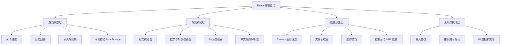

# 《别问模型》技术架构文档

## 1. 架构设计
本项目采用纯前端架构，不接入真实 LLM，不需要后端服务。所有关卡、规则校验、文件检查、图形谜题、状态存档都在浏览器本地执行。



## 2. 技术说明
- 前端：React@18 + TypeScript + Vite。
- 样式：Tailwind CSS@3 + 少量 CSS Modules，用 CSS 变量管理主题和关卡扰动。
- 状态管理：Zustand 或 React reducer。规则引擎建议用纯函数 reducer，便于测试和回放。
- 图形：Canvas 2D。仅在需要复杂路径或阴影投射时封装绘制层，不引入重型 3D。
- 本地能力：File API、localStorage、URLSearchParams、location.hash、Clipboard API、window resize、console 输出。
- 测试：Vitest 覆盖规则引擎、关卡验证器、历史状态回放；Playwright 覆盖关键端到端流程。

## 3. 路由定义
| 路由 | 用途 |
|------|------|
| `/` | 主游戏页，包含全部章节和状态恢复 |
| `/ending` | 终局回收页，也可作为主游戏页内部状态呈现 |
| `/debug-room` | 可选开发路由，用于验证单个关卡和规则栈，不对正式玩家暴露 |

## 4. 核心模块设计

### 4.1 游戏状态
```ts
type GameState = {
  currentLevelId: string;
  answers: AnswerRecord[];
  activeRules: RuleInstance[];
  flags: Record<string, boolean | string | number>;
  sandbox: SandboxState;
  hintBudget: number;
};

type AnswerRecord = {
  levelId: string;
  rawInput: string;
  mutatedInput: string;
  acceptedAt: number;
  extractedToken?: string;
};
```

### 4.2 关卡定义
```ts
type LevelDefinition = {
  id: string;
  chapter: string;
  title: string;
  prompt: string;
  validators: Validator[];
  rulesToAdd?: RuleFactory[];
  mutators?: InputMutator[];
  sandbox?: SandboxDefinition;
  onPass?: (state: GameState, input: string) => GameState;
};
```

设计原则：
- 关卡本身只描述“本关新增内容”。
- 永久规则由 `activeRules` 统一执行，避免每关重复写旧规则。
- 验证器必须返回结构化失败原因，方便 UI 高亮对应规则。

### 4.3 规则校验
```ts
type ValidationResult =
  | { ok: true; extractedToken?: string }
  | { ok: false; ruleId: string; message: string; trustworthy: boolean };

type Validator = {
  id: string;
  priority: number;
  description: string;
  validate: (ctx: ValidationContext) => ValidationResult;
};

type ValidationContext = {
  input: string;
  displayedInput: string;
  state: GameState;
  browser: BrowserSnapshot;
};
```

规则执行顺序：
1. 收集浏览器环境快照，例如窗口宽度、URL hash、localStorage 指定 key。
2. 对输入执行本关 `mutators`，得到 `displayedInput` 或 `mutatedInput`。
3. 按优先级执行全局永久规则。
4. 执行当前关卡验证器。
5. 通过后追加新规则、记录答案、提取元谜题 token。

### 4.4 输入篡改层
输入篡改不应只是随机恶作剧，而应是可推断谜题。

```ts
type InputMutator = {
  id: string;
  visibleName: string;
  apply: (input: string, state: GameState) => string;
  clue: string;
};
```

可实现的篡改：
- 字符替换：`A -> B`，通过错误提示频次暗示。
- 凯撒位移：第 N 关按 N 位移动。
- 零宽字符注入：显示正常，但长度校验异常。
- 自动补全幻觉：提交前附加模板废话，玩家需要利用删除或转义机制。

### 4.5 谜题沙盒层
| 沙盒类型 | 技术能力 | 用途 |
|----------|----------|------|
| Canvas 图形 | CanvasRenderingContext2D | 节点连线、阴影投字、颜色混合、坐标读数 |
| 文件检查 | File API, FileReader | 文件名、大小、MIME、文本内容 hash |
| 浏览器状态 | location, localStorage, resize | hash 谜题、本地记忆、窗口尺寸条件 |
| 控制台线索 | console.log, window 全局变量 | F12 关卡、诱饵变量、隐藏 getter |
| 迷你游戏 | React state + Canvas | 扫雷路径、打字反应、简化棋类陷阱 |

### 4.6 不可信 UI
表现层可以撒谎，但底层校验必须可解释、可回放。

实现方式：
- `trustworthy: false` 的失败结果会触发“伪错误提示”组件。
- 按钮文案、位置、可点击区域由关卡 flag 控制。
- CSS 伪元素承载可检查线索，例如 `content: "look-at-localStorage"`。
- 中后期让规则卡片可折叠、遮挡、重排，但保留可恢复入口。

## 5. 数据模型

### 5.1 本地存档模型
```ts
type SaveData = {
  version: number;
  state: GameState;
  createdAt: number;
  updatedAt: number;
};
```

存储位置：
- `localStorage["askless.save"]`：主存档。
- `localStorage["askless.memory"]`：可被谜题读取和要求修改的“模型记忆”。
- `sessionStorage["askless.run"]`：本次会话的临时扰动状态。

### 5.2 关卡内容数据
关卡建议用 TypeScript 模块而不是远程 JSON，因为验证器需要函数。

```ts
export const levels: LevelDefinition[] = [
  {
    id: "01-basic-arithmetic",
    chapter: "模型上线",
    title: "请回答 2+2",
    prompt: "用户问：2+2 等于多少？请替模型回答。",
    validators: [containsText("4")],
    rulesToAdd: [mustEndWith("喵")]
  }
];
```

## 6. API 定义
无后端 API。所有数据本地执行。

可选导入导出：
```ts
type ExportedProgress = {
  version: number;
  compressedState: string;
  checksum: string;
};
```

## 7. 关键实现风险
| 风险 | 影响 | 缓解 |
|------|------|------|
| 永久规则过多导致不可解 | 玩家卡死 | 增加规则优先级、冲突转义机制、提示预算 |
| DevTools 题过于小众 | 非技术玩家流失 | 每题提供页面内暗示和移动端替代入口 |
| 输入篡改像随机 bug | 挫败感高 | 篡改必须稳定、可观察、可逆推 |
| 文件任务引发隐私担忧 | 信任下降 | 明确本地读取，不上传；只检查空文件或无敏感内容 |
| 终局元谜题线索丢失 | 无法收束 | 时间线面板保留所有关键 token，但不直接解释 |

## 8. 实施阶段建议
1. **MVP**：完成主游戏页、规则栈、前 10 关、存档、基础提示。
2. **系统扩展**：加入输入篡改、不可信 UI、Canvas 沙盒、文件任务。
3. **深度关卡**：实现 11-25 关，补齐 DevTools 和迷你游戏关卡。
4. **终局与打磨**：实现元谜题提取、结局、动效、无障碍和回放测试。
5. **测试与平衡**：记录失败原因分布，调整提示、错误文案和规则冲突难度。
